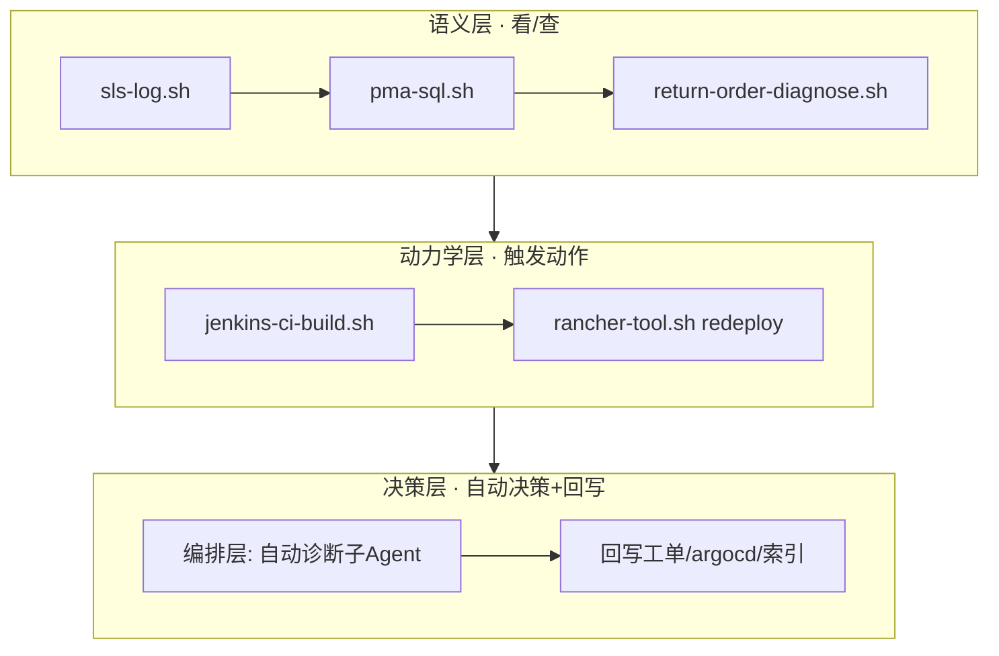

# 工程实践-自动化本体论（Automation Ontology / Operation Twin）

> 定义：把 harness 自动化脚本映射到**语义/动力学/决策三层**（决策层=Palantir 动态层 Dynamic 的 harness 落地名，因示例企业缺口正是"自动决策+回写"），从"工具脚本"升级为"带决策层的操作孪生"——脚本不再只告诉你"库存不够了"，而是帮你"把单下了"。
> 渊源：Palantir Ontology 三层模型（`理念-本体论.md`）+ 2026-08-27 六代理并行盘点（wf_b49076c4-a1e）。
> 关联：`理念-本体论.md`（三层理论）/ `理念-本地轮回.md`（轮回骨架）/ `e2e-testing-rules`（落库双验证）/ constitution 质量门禁。

## 一、三层映射表（现状盘点）

| 层 | 脚本 | 一句话能力 | 断点 |
|----|------|-----------|------|
| 语义层（只读看/查） | sls-log.sh | SLS 查生产/UAT 日志 | 输出原始行，无 ERROR 聚合/结论 |
| | pma-sql.sh | 取数原语 | 返回不解释 |
| | return-order-diagnose.sh | B2B 退货四维诊断一次查全 | 并列打印，无自动判定 |
| | spec-monitor.sh | Spec 并行状态监控 | 无超时/阻塞告警 |
| | check-mq-consumers.sh | 枚举 MQ 消费者 | 无"发布无消费"告警 |
| | check-feign-consumers.sh | 枚举 Feign 调用方 | 无契约漂移检测 |
| 动力学层（触发动作） | jenkins-ci-build.sh | 触发构建→提取镜像 tag | 停在"人工改 argocd" |
| | rancher-tool.sh | 查部署/pod/日志 + redeploy | 无健康失败自动回滚 |
| 决策层（自动决策+回写行动） | — | — | 全部断点在此，空转 |

## 二、决策层升级路径（每脚本现状→升级）

| 脚本 | 升级动作 | 价值 | 优先级 |
|------|---------|------|:---:|
| jenkins-ci-build.sh | 出 tag 后自动 PATCH argocd values（Image.Tag）→ 调 rancher-tool redeploy → 轮询 ready → 回写结果 | CI→部署→验证→报告决策链（**P0 示范闭环，先走通这条**） | P0 |
| sls-log.sh | 命中 ERROR 自动聚合堆栈 top-N + 匹配 `.claude/incidents/` 案例库 → 输出"疑似根因+参考工单" | 诊断结论化 | P1 |
| rancher-tool.sh | 加 health-gate：deploy 后 ready 不达标 → 自动拉最近日志 + 自动回滚上一 observedGeneration + 告警 | 自愈升级 | P1 |
| return-order-diagnose.sh | 四维接规则引擎（如 status≠已签收 且 QC明细未回仓 → 判定卡在入库单未建）→ 输出结论+建议修复 | 排查方法论机械沉降 | P1 |
| check-mq-consumers.sh | 事件类生产者 vs 消费者对比，发布无消费即告警 | 缺口检测（bulkfile-import-no-consumer 实证） | P1 |
| check-feign-consumers.sh | 加契约注册表漂移检测 | 契约防漂移 | P2 |
| pma-sql.sh | 保持取数原语不动，上层组合脚本封装业务判定 | 避免每场景重写 SQL | P2 |

## 三、可视化（三层操作孪生）

## 四、编排层落地形态

- sls-log + pma-sql + return-order-diagnose + incidents 组合成 production-troubleshoot 自动诊断子 Agent：产出结论 → 回写工单（决策层落地形态）。

## 五、约束铁律（决策层安全边界）

1. **多读少写**：巡检只读；回写必须确认事件驱动窄操作；幂等键=commit SHA/构建号，重复触发安全。
2. **HITL 门禁**：**计费/库存/发版/生产回滚=人闸门 L1 每步批准**（对应 constitution 安全三条件：计费/库存/权限）；"仅建议"模式（输出结构化 JSON status/decision/action/payload 由人确认）仅适用于低险常规写；自治度用 feature flag 控制。
3. **混合执行**：GitLab/Jenkins API 优先（config.yaml 已登记 Token）；Playwright/UI 只补 API 不覆盖的流程。
4. **Action 级校验**：constitution 禁止模式（事务内远程调用/消费者不幂等）+ 安全三条件（计费/库存/权限）作 Action 校验规则；每个写操作绑定校验+审计。
5. **渐进吸收**：先 read-first 监控层，验证一个闭环（E2E 落库证据）后逐系统引入写回，反对 big-bang（对应 RED-5 追加式开发）。

**版本历史**：2026-08-27 V1.0 新建（wf_b49076c4-a1e I1 自动化三层映射产物）
