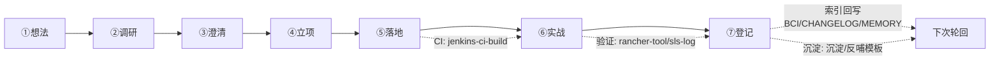

# 理念-本地轮回（Local Loop / Reincarnation）

> 定义：本地轮回 = **想法→调研→澄清→立项→落地→实战→登记** 7 环节闭环，是 harness 复利进化（使用→问题→沉淀→反哺→更好）的**最小工作单元**——把"每产出有落点"从理念落成可操作骨架。
>
> **渊源卡**：
> - 理念出处：harness 哲学"本地轮回"（`rules/harness-philosophy.md` 工作原则 6）
> - 工程渊源：PDCA 循环（Deming）；双环学习（Argyris）；复利进化（使用→问题→沉淀→反哺→更好）
> - 本体呼应：`理念-ontology.md` 三层模型——环节=状态节点、前置/回写边=关系、必备产出+门禁=约束

## 背书/引用备案（背书双轨）

**外部权威**：

| 引用 | 作者/年 | 一句话理念 | URL |
|------|--------|-----------|-----|
| PDCA cycle | Deming 1950s | 计划→执行→检查→处理，持续改进基本环 | https://deming.org/explore/p-d-s-a/ |
| Double-Loop Learning | Argyris & Schön 1978 | 单环修正行动，双环修正行动背后的心智/规则 | https://en.wikipedia.org/wiki/Double_loop_learning |
| progressive absorption | Leading-AI-IO | 先 read-first 挂接→验证闭环→逐系统引入写回→退役遗留段 | https://github.com/Leading-AI-IO/palantir-ontology-strategy |

**内部实证**：`理念-compound-evolution.md`（哲学背书）+ `工程实践-loop-engineering.md`（理念）+ `理念-ontology.md`（三层建模）；本模板 = wf_b49076c4-a1e I2 循环模板盘点产物（2026-08-27）。

## 深入浅出

**一句话本质**：本地轮回把"想→做→记"串成一个 7 态状态机，每环节有"看什么/做什么/门禁判定/索引回写"，保证每个产出有落点、错只犯一次。

**反模式**：只"想"不"做"（想法无落点）；只"做"不"记"（无沉淀，轮回断链）；跳过前半段直接写码（违反 No Spec No Code 铁律）。

## 示例企业实践对应：7 环节 × 三层状态机骨架

| 环节 | 语义层（看/查：产出） | 动力学层（触发动作） | 决策层（门禁判定+索引回写） | 门禁 |
|------|---------------------|---------------------|----------------------------|------|
| ① 想法 | 想法卡片（一句话+价值+风险） | — | YAGNI/先查已否判定；否→记弃归档 | 有卡片 |
| ② 调研 | 方案选型调研结论 → `research/` | researcher skill + `方法-方案选型调研模板` | 结论落盘 research/ + 索引更新 | 先搜已有（不闭门造车） |
| ③ 澄清 | requirements.md（AC+影响） | EnterPlanMode 澄清 + 人审 | 人审通过写 requirements | HITL 人审 |
| ④ 立项 | specs 目录 + 00_README | `new-branch.sh`（RED-7）+ feature-dev | CHANGELOG 登记 | 分支基线确认 |
| ⑤ 落地 | 代码+测试 | SDD/BDD 模板 → `build.sh` 编译+本地测试（RED-8 左移）→ `jenkins-ci-build.sh` 触发 CI | CI 结果回写（镜像 tag） | 编译零错误 + L1 通过 |
| ⑥ 实战 | 部署状态+验证结果 | `rancher-tool.sh` 查日志/redeploy + argocd 部署 + E2E（UI+落库双验证） | 部署状态/验证结果回写 | E2E 通过 + 截图留档 |
| ⑦ 登记 | 沉淀文档+索引更新 | `沉淀模板` 5 步 + `反哺模板`（坑→BCI→红线） | BCI/CHANGELOG/MEMORY 索引回写 + 生成继续会话提示词 | 索引已更新 |

## 可视化（团队化规模化要求）

> 团队规模化：每轮回一张"轮回卡"（当前环节+产出+门禁状态），由 `spec-monitor.sh` 式看板聚合，可视化可查（沿用 `方法-知识可视化` README 真相源 + 看板视图模式）。

## 纳入 CI/CD + 查日志自动化（动力学→决策层闭环）

- `jenkins-ci-build.sh` = 「落地→实战」自动节点（触发构建→拿 tag→PATCH argocd→redeploy）
- `rancher-tool.sh` = 「实战」验证节点（查日志/redeploy/健康检查）
- 执行后回写部署状态/验证结果，与登记环节索引回写串联成自动闭环——解决"工具游离轮回外、登记靠手写"断点。详见 `工程实践-automation-ontology.md`。

## 时间维度（4 级节奏：治理是节奏不是事件）

| 节奏 | 内容 | 触发 |
|------|------|------|
| 工单级 | 一工单一轮回（每条需求/Bug 走完 7 环节） | 任务分配 |
| 日级 | 每日沉淀 / 继续会话 | /compact 或收工 |
| 周级 | 循环门禁：harness-governance + `harness-size.sh -g` | /loop（CronCreate） |
| 月级 | 模板审计 / 触发统计 / 组件健康 | /loop 月定时 |

## 检查清单（每个轮回闭环前）

□ 7 环节都走了吗？□ 每环节门禁通过？□ 产出落盘（research/specs/incidents）？□ 索引回写（BCI/CHANGELOG/MEMORY）？□ 生成继续会话提示词？□ 轮回卡可视化可查？

**版本历史**：2026-08-27 V1.0 新建（wf_b49076c4-a1e I2 循环模板盘点产物；呼应理念-复利进化/循环工程/本体论）
