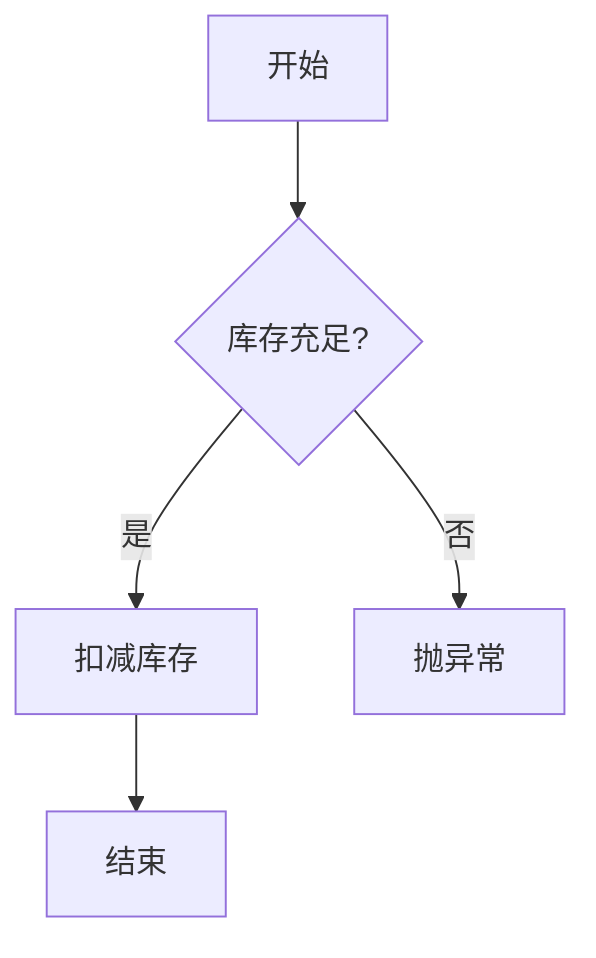
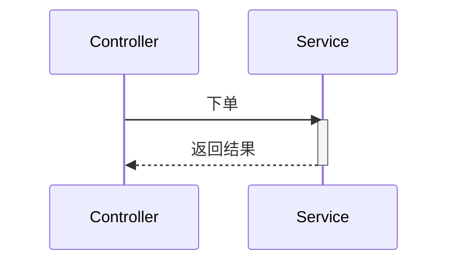
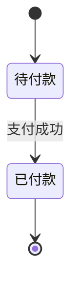
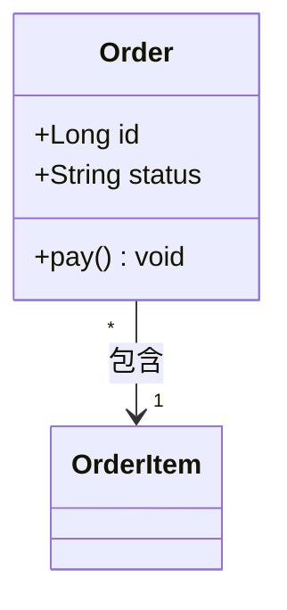
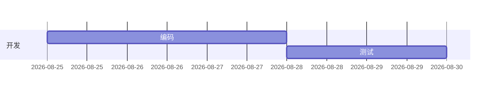
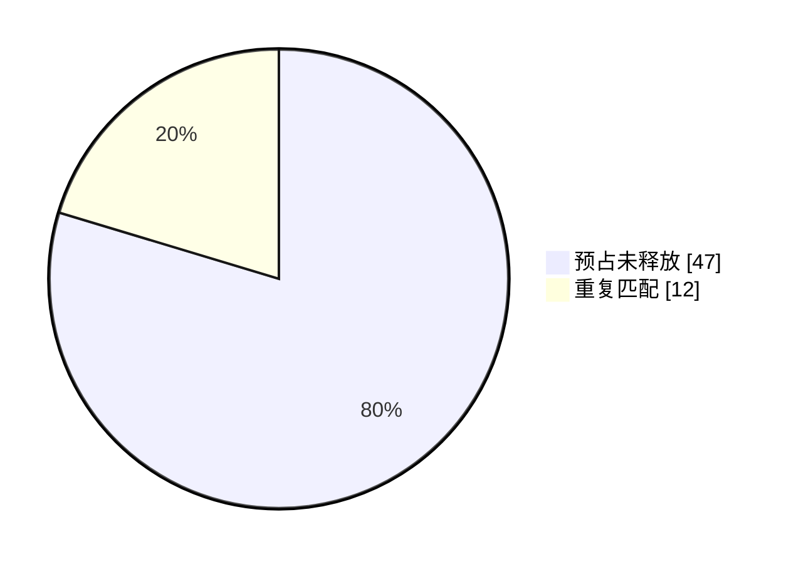
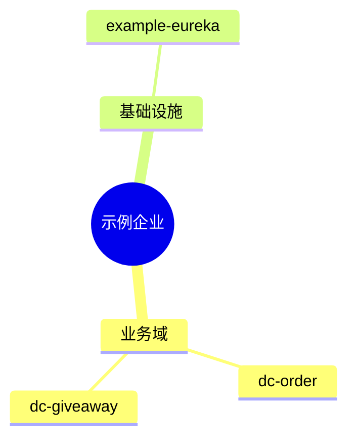

# Mermaid 图表样板（7 图型）

> 用途：流程/SOP/架构/时序/状态文档配图，AI 有样学样——选图型→套骨架→自检。
> 语法源：mermaid.js.org 官方 docs + mermaid.live 校验。

## 一、图型速查表

| 图型 | 声明 | 适用场景 | 语法要点 |
|------|------|---------|---------|
| 流程图 | `flowchart TD` | 流程/SOP/决策 | 菱形决策 `{}`；`subgraph` 分组；`A-->|条件|B` |
| 时序图 | `sequenceDiagram` | 跨服务/MQ/Feign | 显式声明参与者；`activate` 激活条；`loop/alt` 块；`Note` |
| 状态图 | `stateDiagram-v2` | 订单/出库状态流转 | `[*]` 起止；`A --> B : 事件`；复合态 `state X{}` |
| 类图 | `classDiagram` | 实体/表结构 | `+` 可见性；`<|--` 继承、`-->` 关联 |
| 甘特图 | `gantt` | 排期/Spec 阶段 | 先 `dateFormat`；`section` 分组；`after` 依赖 |
| 饼图 | `pie` | 占比统计 | `"标签" : 数值`；`showData` 显数值 |
| 思维导图 | `mindmap` | 结构/概念梳理 | **缩进用空格非 Tab**；`((根))`/`[方]`/`(圆)` |

## 二、语法骨架（可复制）

### 1 流程图

### 2 时序图

### 3 状态图

### 4 类图

### 5 甘特图

### 6 饼图

### 7 思维导图

## 三、最佳实践

1. **图+文双轨**：图配文字并存，图直观、文可检索；渲染失败降级读文字。
2. **复杂拆子图**：单图 <20 节点，超限按阶段 `subgraph` 或多图。
3. **命名语义化**：节点 ID 用英文（`StockCheck`），标签用中文业务描述。
4. **`%%` 注释**：复杂边/条件必加注释。
5. **渲染前自检**：块 `end` 配对、保留字加引号、mindmap 用空格——mermaid.live 校验。

## 四、示例企业实例

- `rules/harness-philosophy.md`：顶部 mermaid `mindmap`（三层体系）+ `flowchart`（复利 loop）。
- `rules/specs-rules.md` §十：mermaid 流程图（并行决策矩阵）。

## 版本历史

| 日期 | 版本 | 变更 |
|------|:---:|------|
| 2026-08-25 | V1.0 | 新建：7 图型速查 + 骨架 + 最佳实践 + 实例 |
